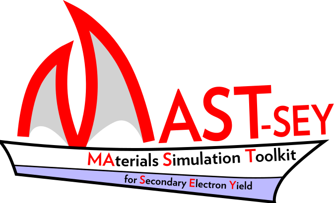

<h1 align="center">

</h1>

MAST-SEY is an open-source Monte Carlo code capable of predicting secondary electron emission using input data generated entirely from first principle (density functional theory) calculations. It utilises the complex dielectric function and Penn's theory for inelastic scattering processes, and relativistic Schrödinger theory by means of partial-wave expansion method to govern elastic scattering. It allows to not only use the momentum independent (q=0) dielectric function but also to include explicitly calculated momentum dependence, as well as to utilise first-principle density of states in secondary electron generation. 

## Installation

1. Download the source code and compile with `gcc`, version > 6.2 of `gcc` is recommended.
```bash
g++ -std=c++11 -g -O3 -o mast_sey mast_sey.cpp
```
2. Download the elsepa code: https://md-datasets-cache-zipfiles-prod.s3.eu-west-1.amazonaws.com/5zzrz874tt-1.zip (https://doi.org/10.1016/j.cpc.2004.09.006)
3. Apply the `elscata.patch` in the downloaded directory
```bash
patch elscata.patch elscata.f
```
4. Copy the executables `mast_sey1` and `elscata` to a convenient location
5. Add that location to your PATH:
```bash
export PATH=${PATH}:/complete/path/to/your/mast_sey
```    
Yyou can add that line to your .bashrc of you dont want to execute it each time
6. Make sure that the copied files are executable:
```bash
chmod +x mast_sey elsepa
```

## Usage

The code is executed in two steps:
1. "prepare" stage:
This step postprocesses the input files to a form convenient for the second step to use. It takes the dielectric function `eps.in` or the energy loss function `elf.in`, and using the parameters contained in `material.in`, prepares the cumulative integrals of cross sections. These results are stored in `inelastic.in` and `elastic.in`. Additionally a file `mfp.plot` is generated, and allows for a convenient plotting of the inelastic and elastic mean free paths, which are generated in this step as well. This step is performed only once for each case.

The command below is an example of how to run the "prepare" step:
```bash
mast_sey prepare -e 1000 100 -i 100 50 -qdep DFT -elastic P DHFS FM
```
In this example, the cumulative integrals will be calculated in the energy range (`-e`) between the Fermi energy (read from `material.in`) and 1000 eV, on a grid of 100 points on a logarithmic scale. The integrals (`-i`) in energy and q (momentum) space will be calculated on grids of 100 and 50 equally spaced points, respectively. A DFT calculated q-dependence (`-qdep`) of energy loss function will be used. The elastic scattering cross sections(`-elastic`) will be calculated using a model with [P]oint nuclear charge, [D]irac-[H]artree-[F]ock-[S]later electron model, and [F]urness-[M]cCarthy exchange.

After running this step, new files, `inelastic.in` and `elastic.in` will be created, as well as `mfp.plot`. The first two will be used in the second step of running the code, while the `mfp.plot` can be used to plot the obtained elastic and inelastic mean free paths in the users plotting program of choice.

2. The "execute" step:
```bash
mast_sey execute -e 350 -m 10000
```
In this example, the secondary electron yield (SEY) will be calculated using the Monte Carlo method for 10000 electrons (`-m`) and their incident energy (`-e`) equal to 350 eV. The last two lines of the output should look similar to the following:
```bash
# Energy[eV]     SEY TrueSEY   Bcksc DifPrim  eBcksc
    350.0000  0.7759  0.3614  0.4145  0.3077  0.0573
```
Where the incident energy is repeated (`Energy[eV]`), and the values in question are presented: total secondary electron yield (`SEY`), true SEY i.e. SEY for electrons escaping through the surface  with energy < 50 eV (`TrueSEY`), backscattered electrons i.e. electrons which escaped with energy > 50 eV (`Bcksc`), diffused primaries i.e. primary electrons which escaped after a series of elastic and inelastic scattering events (`DifPrim`), and elastically backscattered electrons i.e. primary electrons which escaped after undergoing elastic scattering events only (`eBcksc`).

The `examples` directory containes all the necessary input files to run this example.

## License
[MIT](https://choosealicense.com/licenses/mit/)
